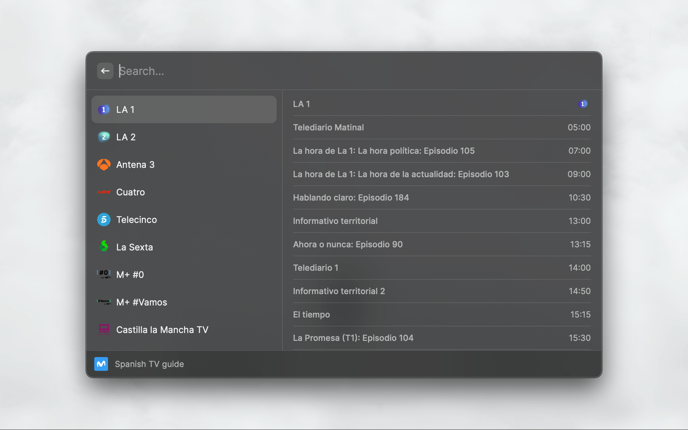

     
     
    
    <h3>Spanish TV Guide</h3>
    
Browse the Spanish TV schedule — channels, live programs, and full show details — without leaving your keyboard.

     
     

A [Raycast](https://www.raycast.com/) extension to browse the Spanish TV schedule — channels, live programs, and full show details — without leaving your keyboard.

## Features

- **Channel list** — browse all major Spanish TV channels (LA 1, LA 2, Antena 3, Cuatro, Telecinco, La Sexta, M+ and more) with their logos
- **Today's schedule at a glance** — selecting a channel instantly shows its full day schedule in a sidebar, with program names and start times
- **Live indicator** — a clock icon marks the program currently on air so you always know what's live right now
- **Program details** — drill into any program to see its description, air time, and a preview image
- **Always up to date** — schedule data is fetched fresh every time, with client-side timezone handling so times are always shown in your local time

## Usage

1. Open Raycast and search for **Spanish TV Guide**
2. Browse the channel list — the sidebar shows today's schedule for the highlighted channel
3. Press `↵` on a channel to open its full schedule
4. Press `↵` on any program to read its details

## Supported Platforms

- macOS
- Windows

## Author

[doktor500](https://github.com/doktor500)

## License

MIT
